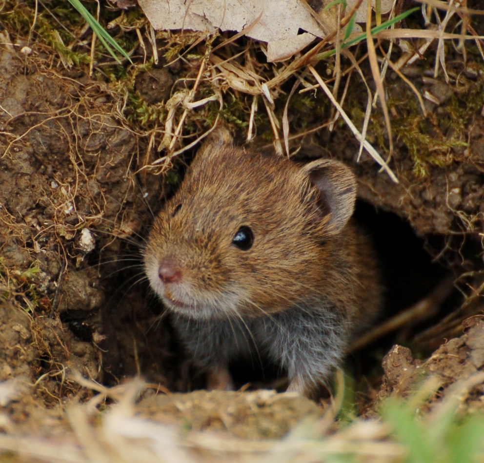

```{r setup, include=FALSE}
options(width = 300)
knitr::opts_chunk$set(cache = FALSE) ### wonder if that's not changing the size of the html https://bioinfo-fr.net/maitrisez-cache-de-rmarkdown
library(rstan)
rstan_options(auto_write = FALSE)
options(mc.cores = parallel::detectCores())
library(MASS)
library(knitr)
library(bayesplot)
```


## An empirical example from Western France: common voles

{ width=35% }

These tend to have regular outbreaks aka population cycles, as mentioned early on by Charles Elton in 1942 in *Voles, Mice and Lemmings*:

> Generally speaking each vole plague has been considered as an isolated event, with its own cycle of destruction, public excitation, desperate measures, final relief (from one cause or another), and dismissal from thought. 
> Such a staccato consciousness of the phenomenon is not justified

## Time series monitoring of vole population cycles

\footnotesize

From [Barraquand, F., Pinot, A., Yoccoz, N. G., & Bretagnolle, V. (2014). Overcompensation and phase effects in a cyclic common vole population: between first and second-order cycles. Journal of Animal Ecology, 83(6), 1367-1378](https://besjournals.onlinelibrary.wiley.com/doi/full/10.1111/1365-2656.12257)

\normalsize

{ width=95% }

## Now back to continuous-time theory

What does create population cycles? Delayed negative feedback

$$ \frac{dN}{dt} = r N(t) \left(1-\frac{N(t-\tau)}{K}\right) $$

as opposed to logistic with immediate negative feedback

$$ \frac{dN}{dt} = r N(t) \left(1-\frac{N(t)}{K}\right) $$

To have cycles with instantaneous feedback in ODEs you need at least two coupled equations. 


## The logistic equation in discrete and continous time

One can show that 

$$ \frac{dN}{dt} = r N(t) \left(1-\frac{N(t)}{K}\right) $$

is *exactly* equivalent to 

$$ N(t+1) = N(t) \frac{e^r N(t)}{1+\frac{\left(e^r-1\right)}{K}N(t)} $$

which is the Beverton-Holt model. Tips:

- use [separation of variables](https://en.wikipedia.org/wiki/Separation_of_variables)
- and the formula $\frac{1}{X(1-X)} = \frac{1}{1-X} +\frac{1}{X}$

Works for $S=2$ species too, no exact discrete-time equivalent to the continuous-time Lotka-Volterra as soon as $S=3$. 

## Discrete-time models that are **not** equivalent to the logistic model

>- **Ricker** $$N(t+1) = N(t) \exp \left(r\left(1-\frac{N(t)}{K}\right)\right)$$
>- **Hassell** $$N(t+1) = \frac{e^r N(t)}{(1+ \alpha N(t))^\beta}$$ (unless $\beta = 1$)
>- **Logistic map** $$N(t+1) = N(t) R \left(1-\frac{N(t)}{K}\right)$$ (horrible model unless R is very small, don't do this unless you have tiny time steps)

## Overcompensation aka carrying capacity overshoots {.allowframebreaks}

```{r simulating-ricker}
r = 4
K = 10
N = rep(1,100)
N[1] = 1
for (t in 1:99){
  N[t+1] = N[t]*exp(r*(1-N[t]/K)) #Ricker growth
}
plot(N[1:99],N[2:100],xlab = "N(t)",
     ylab = "N(t+1)",pch = 19)
curve(x*exp(r*(1-x/K)),from = 0.001, 
      to = max(N),add = TRUE)
abline(v=10,col="red",lwd=2)
abline(h=10,col="red",lwd=2)
```

## Time series with overcompensation

```{r simulating-ricker-ts, echo = FALSE}
plot(1:100, N[1:100],xlab = "Time",
     ylab = "N(t)", type = "b", pch = 19)
abline(h=10,col="red",lwd=2)
```

## Undercompensation under the Beverton-Holt model {.allowframebreaks}

```{r simulating-bevholt}
r = 4
K = 10
N = rep(1,100)
N[1] = 1
for (t in 1:99){
  N[t+1] = N[t]*exp(r) / (1+(exp(r)-1)*N[t]/K)
}
plot(N[1:99],N[2:100],xlab = "N(t)",
     ylab = "N(t+1)",pch = 19)
curve(x*exp(r) / (1+(exp(r)-1)*x/K),from = 0, 
      to = 1.1*K,add=TRUE)
abline(v=10,col="red",lwd=2)
abline(h=10,col="red",lwd=2)
```


## Time series with undercompensation 

```{r simulating-bevholt-ts, echo = FALSE}
plot(1:100, N[1:100],xlab = "Time",
     ylab = "N(t)", type = "b", pch = 19)
abline(h=10,col="red",lwd=2)
```


## Discrete-time overcompensating models 

= models with embedded time delays. Fitness computed between $t$ and $t+1$ depends on $N(t)$. Thus models with a single time lag can already behave very differently from continuous time models without delays. 

This is why we can observe chaos in such discrete-time models [as shown by May (1976) in *Nature* ](https://www.nature.com/articles/261459a0). 

## Back to our vole dynamics example

We do have over overcompensation obvious from the plots 

{ width=95% }

Also a feature found  in many surveys of common voles in Turchin 2003's *Complex Population Dynamics* (PUP). Thus if we want to fit models they have to account for this overcompensation. 


## Nonlinear models fitted

We used models by Maynard Smith and Slatkin (MSS) and Hassell

{ width=75% }

I recommend the MSS model, also used in [Soay Sheep](https://www.nature.com/articles/355823a0) but we'll focus on Hassell for simplicity. Now removing (1) multiple sites, (2) additional delays or phase-dependence. 


## These do work -- simulated time series from the model 

{ width=70% }


## Simulating and fitting the Hassell model in Stan

$$N(t+1) = \frac{e^{r+\epsilon_t} N(t)}{(1+ \alpha N(t))^\beta}, \; \epsilon_t \sim \mathcal{N}(0,\sigma^2)$$

We'll use values close to those estimated from our paper, that is $r = 2.5$, $\alpha = 1$, $\beta = 2$, $\sigma^2 = 1$. 

A frequent caveat--sometimes we write 

$$N(t+1) = \frac{e^r N(t)}{(1+ N(t)/K)^\beta}$$

(unfortunately we did in Barraquand, Pinot et al. 2014). Then such $K$ is not exactly the carrying capacity, here equal to $N^* = \frac{1}{\alpha} \left(e^{r/\beta} - 1 \right)$. 


## Simulating the Hassell model {.allowframebreaks}

```{r simulating-hassell}
r = 2.5
alpha = 1
beta = 2
sigma = sqrt(1)
N = rep(1,100)
N[1] = 1
for (t in 1:99){
  N[t+1] = N[t]*exp(r+rnorm(1,0,sigma))/
    ((1+alpha*N[t])^beta)
}

plot(1:100, N[1:100],xlab = "Time",
     ylab = "N(t+1)", type = "b", pch = 19)
abline(h=10,col="red",lwd=2)
```

## Fitting the Hassell model { .allowframebreaks }

Prep the data

```{r prep-data}
data <- list(x=log(N), tmax = 100)
```

Specify the model in log-scale

$$N(t+1) = \frac{N(t) e^{r+\epsilon_t}}{(1+ \alpha N(t))^\beta}, \; \epsilon_t \sim \mathcal{N}(0,\sigma^2)$$

is equivalent to 

$$\ln(N(t+1)) = \ln(N(t)) + r + \epsilon_t - \beta \ln(1 + \alpha N(t)), \; \epsilon_t \sim \mathcal{N}(0,\sigma^2)$$

which is easy to specify as a probability distribution. 

\footnotesize

```{stan output.var="model.hassell"}
data {                // observed variables
  int<lower=1> tmax;  // number of observations
  vector[tmax] x;     // state variable
}
parameters {            // unobserved parameters
  real r;               // growth rate
  real<lower=0> alpha;  // density-dependence
  real<lower=0> beta;   // density-dependence exponent
  real<lower=0> sigma;  // sd noise growth rate
}
model {
  //priors
  r ~ normal(0,1);
  alpha ~ exponential(10);
  beta ~ exponential(10);
  sigma ~ exponential(10);
  //likelihood
  for (t in 1:(tmax-1)){
  x[t+1] ~ normal(r+x[t]-beta*log(1+alpha*exp(x[t])),sigma);
  }
}
```

```{r stan-code, eval=F, include=F}
sink("model.hassell.stan") ### for me, useful to debug
cat("
data {                                             // observed variables
  int<lower=1> tmax;                               // number of observations
  vector[tmax] x;                                  // state variable
}
parameters {                                       // unobserved parameters
  real r;                                          // growth rate
  real<lower=0> alpha;                             // density-dependence
  real<lower=0> beta;                              // density-dependence exponent
  real<lower=0> sigma;                             // sd noise growth rate
}
model {
  //priors
  r ~ normal(0,1);
  alpha ~ exponential(10);
  beta ~ exponential(10);
  sigma ~ exponential(10);
  for (t in 1:(tmax-1)){
  x[t+1] ~ normal(r+x[t]-beta*log(1+alpha*exp(x[t])),sigma);
  }
}
"
,fill=TRUE)
sink()
```


```{r print_model, cache=T, echo = F}
#modelH <- stan_model(file = "model.hassell.stan")
#fit.hassell <- sampling(modelH, data = data, 
#                        iter = 1000, chains = 2, cores = 2)
fit.hassell <- sampling(model.hassell, data = data, 
             iter = 1000, chains = 2, cores = 2)
print(fit.hassell, probs = c(0.10, 0.5, 0.9))

```


```{r pairs, echo = F}
mcmc_pairs(as.array(fit.hassell), 
           np = nuts_params(fit.hassell),
           pars = c("r","alpha","beta","sigma"), 
           off_diag_args = list(size = 1,alpha=1/3),
           np_style = pairs_style_np(div_size=2, 
                                     div_shape = 19))
```


## The Gompertz, log-linear AR(1) model

The power-law model $N_{t+1} = N_t e^{r_0+\epsilon_t} N_t^{\alpha}$ is equivalent to $\ln(N_{t+1}) = \ln(N_t) + r_0 + \alpha \ln(N_t) + \epsilon_t$ which is also called an AutoRegressive model of order 1. [Dennis and Taper (1994) *Ecology*](https://esajournals.onlinelibrary.wiley.com/doi/abs/10.2307/2937041). 

![Overcompensation for $\alpha<-1$, here $-1.18 [-1.39; -0.98]$](fig/Fig6.pdf){ width=75% }


## The deal with delayed density-dependence

Previous model can be written with $x=\ln(N), \; x_{t+1} = x_t + r_0 + \alpha x_t + \epsilon_t$. Centering $x$ we can even get 
$x_{t+1} = a x_t + \epsilon_t$. AR(1) model. In general people use for population cycles an AR(2) model $x_{t+1} = a_1 x_t + a_2 x_{t-1} + \epsilon_t$.

{ width=55% } 

## What do we show in this J Anim Ecol 2014?

- **overcompensation** is essential to reproduce fast declines
- Phenomenological AR(1) or AR(2) models on the logarithmic scale don't do a very good job at reproducing the shape of density-dependence -- we propose various alternatives
- Nonlinear Hassell models including a `low phase' work well

{ width=75% }

## What does that mean biologically speaking? 

Could be multiple mechanisms for cycles with

- a cause that generates fast declines like overconsumption of weeds, increased parasites, or both
- something that maintains a `low phase' after peaks with lesser growth (all other things equal) and spatial synchrony, such as avian predators

{ width=95% }

## To go beyond

\footnotesize

The paper: [Barraquand, F., Pinot, A., Yoccoz, N. G., & Bretagnolle, V. (2014). Overcompensation and phase effects in a cyclic common vole population: between first and second-order cycles. Journal of Animal Ecology, 83(6), 1367-1378](https://besjournals.onlinelibrary.wiley.com/doi/full/10.1111/1365-2656.12257)

\normalsize

Stuff that we could and should perhaps have done: fully spatial Bayesian analysis with a model of the form

$$N_{t+1,i} = N_{t,i} \frac{\exp(r + \eta_t + \zeta_{t,i})}{(1+\alpha N_{t,i} )^{\beta}}, \; \eta_{t} \sim \mathcal{N}(0,\sigma_T^2), \; \zeta_{t,i} \sim \mathcal{N}(0,\sigma^2)$$

(done!) and some refinements for phase-dependence like 

$$N_{t+1,i} = N_{t,i} \frac{\exp(r + \eta_t + \zeta_{t,i})}{(1+\alpha[\text{phase}_t] N_{t,i} )^{\beta[\text{phase}_t]}}, \; \eta_{t} \sim \mathcal{N}(0,\sigma_T^2), \; \zeta_{t,i} \sim \mathcal{N}(0,\sigma^2)$$

Still doable to revisit! Data and code in the GitHub folder. 

## Questions? 

{ width=60% }

## Literature

For more on population cycles and how to model them, see:

- [Bjørnstad, O. N., & Grenfell, B. T. (2001). Noisy clockwork: time series analysis of population fluctuations in animals. Science, 293(5530), 638-643.](https://www.science.org/doi/full/10.1126/science.1062226)

- [Barraquand, F., Louca, S., Abbott, K. C., Cobbold, C. A., Cordoleani, F., DeAngelis, D. L., ... & Tyson, R. C. (2017). Moving forward in circles: challenges and opportunities in modelling population cycles. Ecology letters, 20(8), 1074-1092.](https://onlinelibrary.wiley.com/doi/full/10.1111/ele.12789)

On vole cycles specifically (no modelling, synthesis paper)

- [Andreassen, H. P., Sundell, J., Ecke, F., Halle, S., Haapakoski, M., Henttonen, H., ... & Ylönen, H. (2021). Population cycles and outbreaks of small rodents: ten essential questions we still need to solve. Oecologia, 195(3), 601-622.](https://link.springer.com/article/10.1007/s00442-020-04810-w)